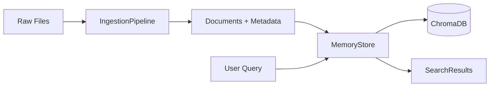

# Chapter 05: Modular Memory Engine

A production-ready vector memory system for AI agents. This implementation demonstrates senior-level architecture patterns for building scalable, maintainable RAG systems.

## 🎯 What You'll Learn

- **Separation of Concerns**: Modular architecture vs monolithic scripts
- **Type Safety**: Pydantic models for all data structures
- **Abstraction Patterns**: Database wrappers for easy provider swapping
- **Robust ETL**: Smart text chunking with overlap and automatic metadata

## 🏗️ Architecture



## 📁 File Structure

```
Chapter_05_Memory/
├── main.py        # Interactive demo script
├── config.py      # Centralized settings (env vars)
├── models.py      # Pydantic data models
├── store.py       # MemoryStore (ChromaDB wrapper)
├── ingest.py      # ETL pipeline with smart chunking
├── __init__.py    # Public API exports
├── requirements.txt
├── .env.example
└── README.md
```

## 🚀 Quick Start

### 1. Setup Environment

```bash
cd Chapter_05_Memory
python -m venv .venv

# Windows
.venv\Scripts\activate

# Linux/Mac
source .venv/bin/activate

pip install -r requirements.txt
```

### 2. Configure Environment

```bash
# Copy and edit the environment file
cp .env.example .env
```

**For local embeddings (default, no API key needed):**
```env
EMBEDDING_MODEL=all-MiniLM-L6-v2
```

**For OpenAI embeddings (better quality):**
```env
OPENAI_API_KEY=sk-your-key-here
OPENAI_EMBEDDING_MODEL=text-embedding-3-small
```

### 3. Basic Usage

```python
from Chapter_05_Memory import MemoryStore, IngestionPipeline

# Initialize pipeline and store
pipeline = IngestionPipeline()
store = MemoryStore()

# Ingest a file
documents = pipeline.ingest_file("./my_document.txt")
print(f"Created {len(documents)} chunks")

# Store documents
store.add_documents(documents)

# Semantic search
results = store.search("What is the main topic?", top_k=3)
for result in results:
    print(f"[{result.score:.2f}] {result.content[:100]}...")
```

## 📖 Component Deep Dive

### models.py - Type Safety

```python
from Chapter_05_Memory import Document, DocumentMetadata, SearchResult

# Every document has strict schema
doc = Document(
    content="AI agents are transforming software...",
    metadata=DocumentMetadata(
        source="agents.pdf",
        chunk_index=0,
        total_chunks=10,
        page_number=1
    )
)
```

**Why this matters**: Pydantic catches errors at development time, not production.

### store.py - Database Abstraction

```python
from Chapter_05_Memory import MemoryStore

store = MemoryStore(collection_name="my_project")

# Add, search, delete - clean interface
store.add_documents(documents)
results = store.search("query", top_k=5)
store.delete(document_ids=["id1", "id2"])
store.delete_by_source("old_file.txt")  # Re-ingestion made easy

# Stats
print(store.get_stats())
```

**Why this matters**: Swap ChromaDB for Qdrant or Pinecone by modifying only this file.

### ingest.py - Smart ETL

```python
from Chapter_05_Memory import IngestionPipeline

# Custom chunking parameters
pipeline = IngestionPipeline(
    chunk_size=500,
    chunk_overlap=50
)

# Single file
docs = pipeline.ingest_file("document.md")

# Batch directory processing
for filename, docs in pipeline.ingest_directory("./data", pattern="*.txt"):
    print(f"Processed {filename}: {len(docs)} chunks")
```

**Why this matters**: RecursiveCharacterTextSplitter preserves semantic boundaries.

### config.py - Centralized Settings

```python
from Chapter_05_Memory import settings

# All configuration in one place
print(settings.CHUNK_SIZE)          # 500
print(settings.EMBEDDING_MODEL)     # all-MiniLM-L6-v2
print(settings.CHROMA_PERSIST_DIR)  # ./data/chromadb
```

**Why this matters**: Zero hardcoded paths. Environment-based configuration.

## 🔧 Advanced Usage

### Metadata Filtering

```python
# Search within specific source
results = store.search(
    "deployment strategies",
    where={"source": "devops_guide.md"}
)

# Filter by date (requires custom metadata)
results = store.search(
    "recent updates",
    where={"year": 2024}
)
```

### Custom Metadata

```python
docs = pipeline.ingest_file(
    "report.pdf",
    extra_metadata={
        "department": "engineering",
        "priority": "high",
        "author": "Mario"
    }
)
```

### Re-ingesting Updated Files

```python
# Delete old chunks first
deleted = store.delete_by_source("outdated_file.txt")
print(f"Removed {deleted} old chunks")

# Ingest updated version
new_docs = pipeline.ingest_file("updated_file.txt")
store.add_documents(new_docs)
```

## 🎬 Interactive Demo

Run the interactive demo to ingest PDFs and perform semantic search:

```bash
python main.py
```

**Menu Options:**
```
[1] Ingest PDF
[2] Search memory
[3] Show stats
[4] Clear all memory
[q] Quit
```

### Example: Searching OpenAI's Agent Guide

```bash
# After ingesting "a-practical-guide-to-building-agents.pdf"

🔍 Searching: "What is Multi-agent systems"
--------------------------------------------------

   [1] Score: 0.790 | Source: a-practical-guide-to-building-agents.pdf p.17
   Multi-agent systems - While multi-agent systems can be designed 
   in numerous ways for specific workflows and requirements...

   [2] Score: 0.782 | Source: a-practical-guide-to-building-agents.pdf p.17
   When to consider creating multiple agents: Our general 
   recommendation is to maximize a single agent's capabilities first...

   [3] Score: 0.762 | Source: a-practical-guide-to-building-agents.pdf p.16
   The model continues to run multiple steps until an exit condition...
```

> **Note**: The PDF is chunked into 95 semantic segments with page-level metadata for precise citations.

## 🧪 Quick Test

```bash
python -c "
from Chapter_05_Memory import MemoryStore, IngestionPipeline

pipeline = IngestionPipeline()
store = MemoryStore()

# Ingest this README as a test
docs = pipeline.ingest_file('README.md')
print(f'✓ Ingested {len(docs)} chunks')

store.add_documents(docs)
print(f'✓ Stored in ChromaDB')

results = store.search('What is this chapter about?', top_k=2)
print(f'✓ Search returned {len(results)} results')

for r in results:
    print(f'  [{r.score:.2f}] {r.content[:80]}...')
"
```

## 🎓 Senior Patterns Demonstrated

| Pattern | Junior Approach | Senior Approach |
|---------|-----------------|-----------------|
| Config | Hardcoded paths | Environment variables |
| Data | Loose dicts | Pydantic models |
| Database | Direct API calls | Abstraction wrapper |
| Chunking | Simple split | Recursive with overlap |
| Metadata | None | Automatic + custom |

## 📚 Next Steps

- **Chapter 06**: Connect this memory to an AI agent via n8n
- **Chapter 07**: Build a multi-agent system with shared memory

## 📄 License

MIT License - See [LICENSE](../LICENSE) for details.
